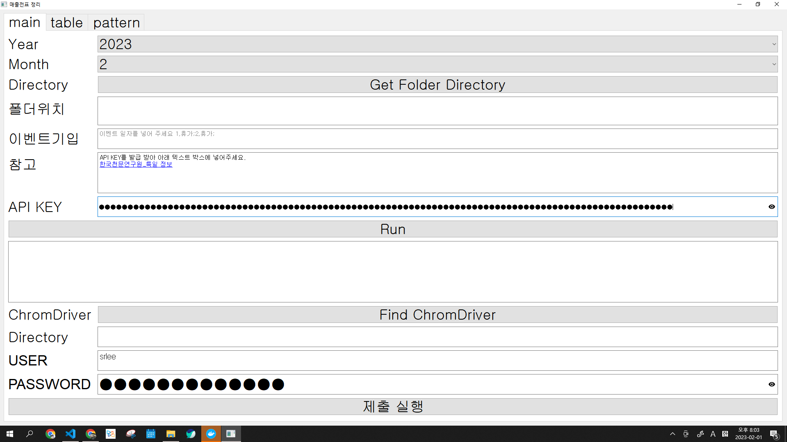
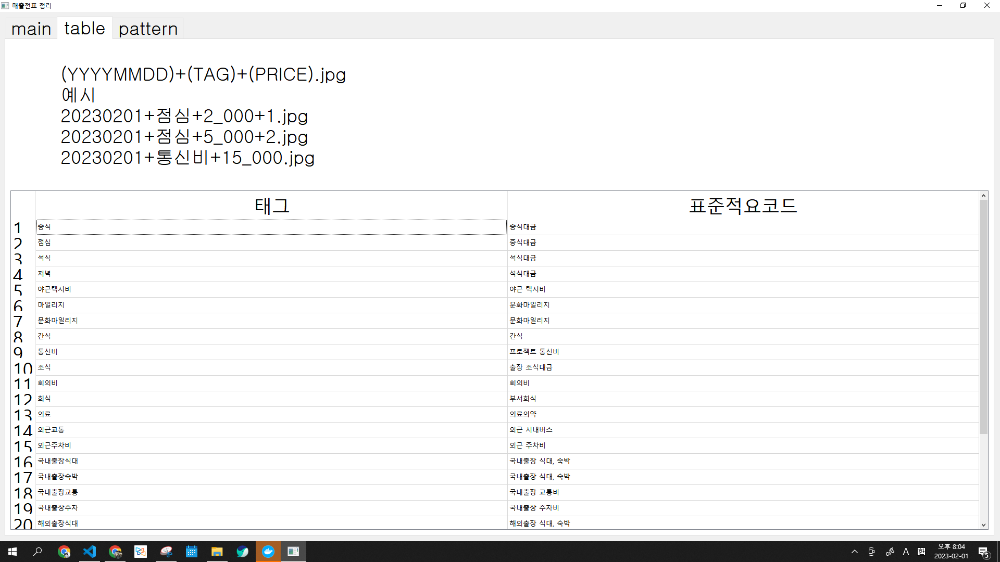
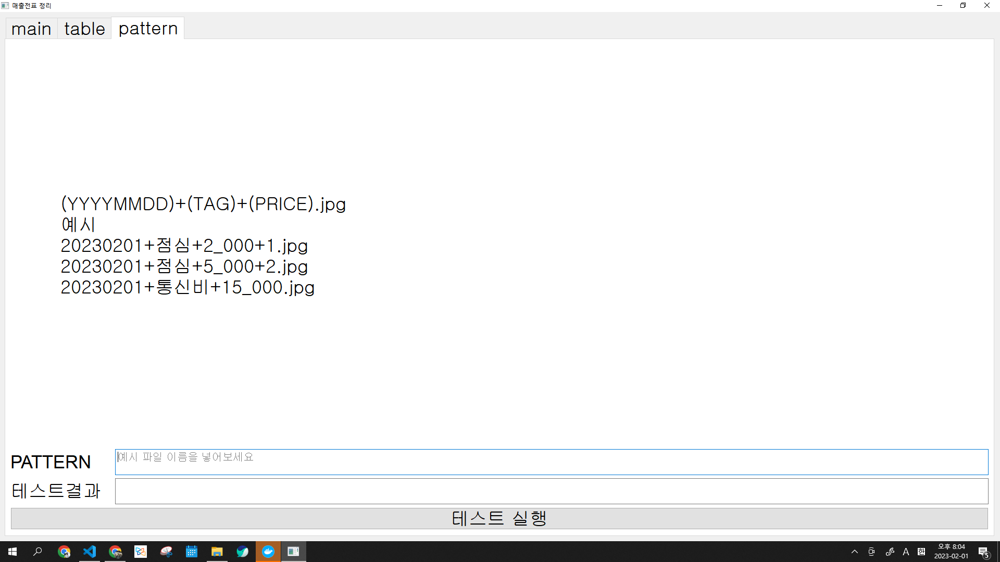

결제 영수증 관리하는 코드

점심값이 통합으로 바뀌게 되면서, 휴가나 휴일을 제외하고 총 얼마를 사용할 수 있는 지, 현재 얼마나 사용했는 지에 대해서 항상 생각해야하는 문제가 있었습니다.
이런 것을 고민하기보다는 결제한 내용에 대한 파일만 존재하면 전체적으로 얼마나 썼는지를 정리해주는 것을 만들어봤습니다.
추후에는 저희 회사 개발자중 한분이신 로건님(👨‍💻)의 파일 형태를 맞추어서 기입 후 바로 결제 올리는 것까지 연계가 되었으면 합니다.

물론 그전에 OCR이 고도화되서, 이런 파일 안만들어도 인식할 수 있게 하면 더 좋을 것 같고요...  화이팅(🎉)


# 참고

- 2022-01-31 [로건 자동 월망 청구 코드 링크](https://github.com/hotorch/acc_contents_selenium) 을 현재 포맷에 맞게 일부 수정함.


# 피드백은 언제나 환영합니다.


# API KET 필요

https://www.data.go.kr/data/15012690/openapi.do

위의 링크를 통해 API 키가 있어야지, 휴일을 확인할 수 있음.

# 이미지 형식 

- 현재는 PNG만 됩니다. 추후 개선...

`[날짜]+[타입]+[금액]+[특이사항].PNG`

`yyyymmdd+[tag_name]+[금액]+[특이사항].PNG`


# 실행 코드

```
python main.py
```

# 실행 화면

## 메인 화면




## 테이블 화면




## 패턴 체크 화면



## 가이드 

1. 현재 년도 설정
2. 결제 올릴 달 지정
3. 결제 올릴 파일이 모인 폴더 선택
4. 특정 휴가나 휴일 이벤트 기입 
    - `일,사유;` # 사유는 현재 휴가만 특별하게 처리됨.
    - 예시
        - 1,휴가;2,휴가;
5. API KEY 입력
    - API KEY를 받아서 입력하기
6. 실행
    - RUN 버튼 클릭하면 3)번의 경로에 파일 생성 (result.xlsx)


# 최신 코드
main.py

# 패키지

- 아래와 같은 코드를 이용하면 대부분 패키지는 해결될 것으로 예상

```
pip install pipreqs
pipreqs ./
pip install -r requirements.txt
```

# EXE 파일 만들기
pyinstaller --noconsole --onefile --icon=./imgs/agilesoda.ico main.py
# 실행

```
python main.py
```

# 이미지 파일 형식

(yyyymmdd)+(tag)+(price)+(기타정보).[jpg|png]

# 예시

- 20221004+중식+4_000+1.PNG
- 20221004+중식+4_000+2.PNG 
  ->  중식 8000(합산됨)
- 20221004+석식+4_000+인원2명.PNG
- 20221004+국내출장교통+10_000+블라블라.PNG


1. yyyymmdd
날짜 적기

1. tag 

tag는 아래 항목만 가능합니다.
```

{
    "중식": "중식대금",
    "점심": "중식대금",
    "석식": "석식대금",
    "저녁": "석식대금",
    "야근택시비": "야근 택시비",
    "마일리지": "문화마일리지",
    "문화마일리지": "문화마일리지",
    "간식": "간식",
    "통신비": "프로젝트 통신비",
    "조식": "출장 조식대금",
    "회의비": "회의비",
    "회식": "부서회식",
    "회의비": "회의비",
    "의료": "의료의약",
    "외근교통": "외근 시내버스",
    "외근주차비": "외근 주차비",
    "국내출장식대": "국내출장 식대, 숙박",
    "국내출장숙박": "국내출장 식대, 숙박",
    "국내출장교통": "국내출장 교통비",
    "국내출장주차": "국내출장 주차비",
    "해외출장식대": "해외출장 식대, 숙박",
    "해외출장숙박": "해외출장 식대, 숙박",
    "해외출장교통": "해외출장 교통비",
    "출장유류비": "출장 유류비",
    "업무용도서": "업무용 도서구입",
    "사무용품": "사무용품",p
    "전산용품": "전산용품",
}
```

나머지 항목들은  표준적요의 코드 이름을 참고해야 함.

1. price
가격 적기

1. 기타정보
몇 명이 먹었는 지 같은 정보 적기(TODO:)


# 결과물

## result.xlsx

- sheet 1. 지출내역
  - 전체적인 지출 내역을 확인할 수 있음.
  - 주말이나 휴일은 포함안함(단 주말 근무를 한 이미지가 있는 경우 생김)

- sheet 2. 점심식대
  - 점심 사용할 수 있는 총 금액과 현재까지 얼마를 사용했는 지 알 수 있음
- sheet 3. 총태그합
  - 각 태그별로 얼마나 썻는 지 확인 가능함.
## sample_data.xslx

- 제출용 파일 생성 
- TODO: 인원수에 대한 부분은 반영하지 못함(개선 필요)
# ToDo List

- [x] 기존에 다른 분께서 만든 코드 결과물 포맷 반영 [로건 자동 월망 청구 코드 링크](https://github.com/hotorch/acc_contents_selenium)
- [ ] 맥에서 실행할 수 있는 파일 만들기
- [ ] 다양한 이미지 파일 수용(JPG,JPEG, ...)
