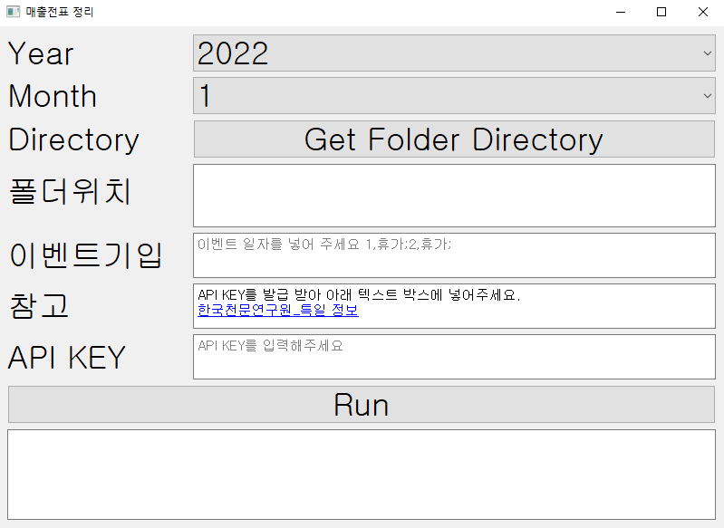

결제 영수증 관리하는 코드

점심값이 통합으로 바뀌게 되면서, 휴가나 휴일을 제외하고 총 얼마를 사용할 수 있는 지, 현재 얼마나 사용했는 지에 대해서 항상 생각해야하는 문제가 있었습니다.
이런 것을 고민하기보다는 결제한 내용에 대한 파일만 존재하면 전체적으로 얼마나 썼는지를 정리해주는 것을 만들어봤습니다.
추후에는 저희 회사 개발자중 한분이신 로건님(👨‍💻)의 파일 형태를 맞추어서 기입 후 바로 결제 올리는 것까지 연계가 되었으면 합니다.

물론 그전에 OCR이 고도화되서, 이런 파일 안만들어도 인식할 수 있게 하면 더 좋을 것 같고요... 트윈스토리 화이팅(🎉)


# 수정은 언제나 환영합니다.


# API KET 필요

https://www.data.go.kr/data/15012690/openapi.do

위의 링크를 통해 API 키가 있어야지, 휴일을 확인할 수 있음.

# 이미지 형식 

- 현재는 PNG만 됩니다. 추후 개선...

`[날짜]+[타입]+[금액]+[특이사항].PNG`

`yyyymmdd+[tag_name]+[금액]+[특이사항].PNG`


## 예시

- 20221004+점심+4_000.PNG
- 20221004+점심+4_000+인원2명.PNG
- 20221004+교통비+10_000+블라블라.PNG

# 실행 코드

```
python main_v2.py
```

# 실행 화면



# 최신 코드
main_v2.py

# 패키지

- 아래와 같은 코드를 이용하면 대부분 패키지는 해결될 것으로 예상

```
pip install pipreqs
pipreqs ./
pip install -r requirements.txt
```

# EXE 파일 만들기
pyinstaller --noconsole --onefile --icon=agilesoda.ico main.py
pyinstaller --noconsole --onefile --icon=agilesoda.ico main_v2.py

# NEXT

- [ ] 기존에 다른 분께서 만든 코드 결과물 포맷 반영 [로건 자동 월망 청구 코드 링크](https://github.com/hotorch/acc_contents_selenium)
- [ ] 맥에서 실행할 수 있는 파일 만들기
- [ ] 다양한 이미지 파일 수용(JPG,JPEG, ...)
