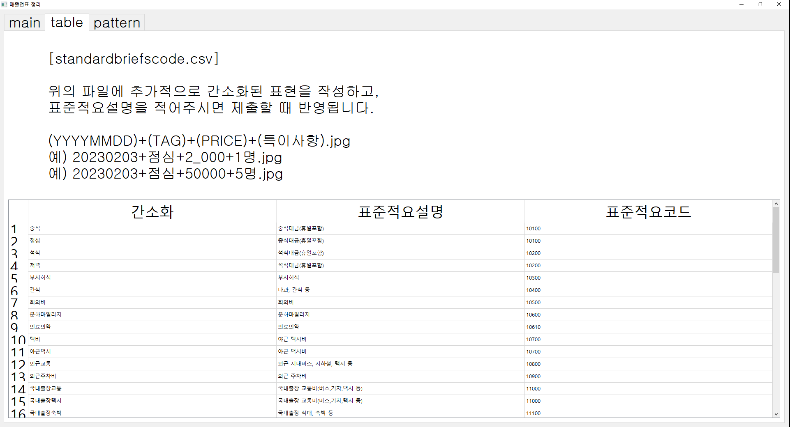

결제 영수증 관리하는 코드

점심값이 통합으로 바뀌게 되면서, 휴가나 휴일을 제외하고 총 얼마를 사용할 수 있는 지, 현재 얼마나 사용했는 지에 대해서 항상 생각해야하는 문제가 생겼습니다.
그리고 전체적으로 사용한 것들에 대해서 관리를 하고 싶을 때, 지출결의서에서는 정렬 기능이 부분별 합산 기능이 없어서 많이 불편했다고 생각합니다.

그래서 사용자가 이미지 파일만 가지고 있을 때, 나의 지출을 관리해주는 것을 만들어보고 싶었습니다.
이미 자동 상신 기능은 로건님이 만들어 주신 것이 있기 때문에, 그것을 이용하였고, 저는 이미지 파일들의 이름에 규칙을 정해서,
그 결과를 취합하는 엑셀 파일, 그리고 로건님 것을 돌리기 위해 필요한 파일을 만들고 상싱하는 기능을 PYQT로 만들어 봤습니다.

추후에는 이미지를 읽어서 경비를 자동으로 처리하는 것도 만들어보고 싶긴 하네요.

# 참고

- 2022-01-31 [로건 자동 월망 청구 코드 링크](https://github.com/hotorch/acc_contents_selenium) 을 현재 포맷에 맞게 일부 수정함.


# 피드백은 언제나 환영합니다.


# API KET 필요

https://www.data.go.kr/data/15012690/openapi.do

위의 링크를 통해 API 키가 있어야지, 휴일을 확인할 수 있음.

# 이미지 형식 

- 현재는 PNG만 됩니다. 추후 개선...

`[날짜]+[타입]+[금액]+[특이사항].PNG`

`yyyymmdd+[tag_name]+[금액]+[특이사항].PNG`


# 실행 코드

```
python main.py
```

# 실행 화면

## 메인 화면


## 테이블 화면




## 패턴 체크 화면


## 가이드 

1. 현재 년도 설정
2. 결제 올릴 달 지정
3. 결제 올릴 파일이 모인 폴더 선택
4. 특정 휴가나 휴일 이벤트 기입 
    - `일,사유;` # 사유는 현재 휴가만 특별하게 처리됨.
    - 예시
        - 1,휴가;2,휴가;
5. API KEY 입력
    - API KEY를 받아서 입력하기
6. 실행
    - RUN 버튼 클릭하면 3)번의 경로에 파일 생성 (result.xlsx)


# 최신 코드
main.py

# 패키지

- 아래와 같은 코드를 이용하면 대부분 패키지는 해결될 것으로 예상

```
pip install pipreqs
pipreqs ./
pip install -r requirements.txt
```

# EXE 파일 만들기
pyinstaller --noconsole --onefile --icon=./imgs/agilesoda.ico main.py
# 실행

```
python main.py
```

# 이미지 파일 형식

(yyyymmdd)+(tag)+(price)+(기타정보).[jpg|png]

# 예시

- 20221004+중식+4_000+1.PNG
- 20221004+중식+4_000+2.PNG 
  ->  중식 8000(합산됨)
- 20221004+석식+4_000+인원2명.PNG
- 20221004+국내출장교통+10_000+블라블라.PNG


1. yyyymmdd
날짜 적기

1. tag 

tag는 아래 항목만 가능합니다.

standardbriefscode.csv에 있는 내용들이 가능하다 (전부 다 포함됨)

추가적으로 사용하고자 하는 간단화된 코드가 있다면, 다음과 같이 작성하면 된다.

예시) 점심식대에 대한 간소화코드 추가

|간소화|표준적요설명|표준적요코드|
|:---:|:---:|:---:|
|ㅈㅅ|중식대금(휴일포함)|10100|


1. price
가격 적기

1. 기타정보
몇 명이 먹었는 지 같은 정보 적기(TODO:)


# 결과물

## result.xlsx

- sheet 1. 지출내역
  - 전체적인 지출 내역을 확인할 수 있음.
  - 주말이나 휴일은 포함안함(단 주말 근무를 한 이미지가 있는 경우 생김)

- sheet 2. 점심식대
  - 점심 사용할 수 있는 총 금액과 현재까지 얼마를 사용했는 지 알 수 있음
- sheet 3. 총태그합
  - 각 태그별로 얼마나 썻는 지 확인 가능함.
## sample_data.xslx

- 제출용 파일 생성 
- TODO: 인원수에 대한 부분은 반영하지 못함(개선 필요)
# ToDo List

- [x] 기존에 다른 분께서 만든 코드 결과물 포맷 반영 [로건 자동 월망 청구 코드 링크](https://github.com/hotorch/acc_contents_selenium)
- [ ] 맥에서 실행할 수 있는 파일 만들기
- [ ] 다양한 이미지 파일 수용(JPG,JPEG, ...)
